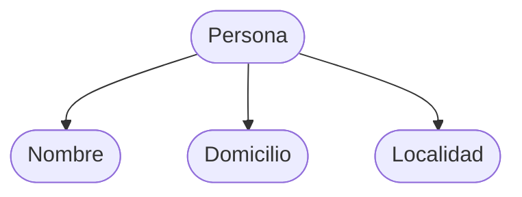

Un registro es un conjunto de **campos** que permanecen juntos cuando el [[Archivo]] es visto en términos de organización de alto nivel. Es referente a una entidad en particular (archivo de paises) y constituyen una unidad para su proceso (un país en particular).

Dado el registro "PERSONA" con sus campos "Nombre", "Domicilio" y "Localidad": se utiliza un **selector de campo** (el ".") como símbolo para determinar el acceso a un campo del registro. En la expresión `reg.Nombre` se accede al campo "Nombre" del registro "PERSONA".

## Definición

### Jerárquica

Un árbol o jerarquía que sirve como un borrador a **mano alzada**:



### Gráfica

Es una forma lineal y analista mediante una **tabla**.

| Nombre  | Domicilio | Localidad |
| ------- | --------- | --------- |
| 30 char | 20 char   | 15 char   |

### Literaria

Es la que utiliza el programador en [[Pseudocódigo]].

```
PERSONA: registro de
	Nombre: AN(30)
	Domicilio: AN(20)
	Localidad: AN(15)
FIN_REGISTRO
```

## Campo

Es un conjunto de caracteres capaz de suministrar una determinada información referida a un concepto. Es la entidad lógica más pequeña, y es la mínima unidad de información de un registro. Nos permiten tener "subsecuencias continuas dentro de una secuencia mayor."

Al definir un campo, se debe indicar un:

- **Nombre**: identifica al conjunto de caracteres.
- **Tipo**: tipo de dato que puede contener.
- **Tamaño**: cantidad de caracteres que puede contener.

Ejemplo: `dni: N(8)`.
