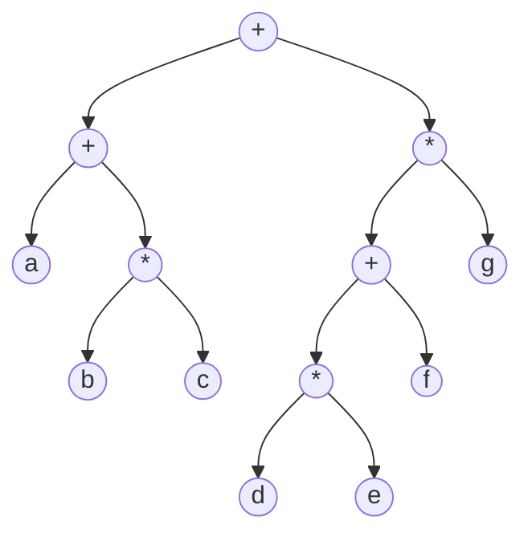
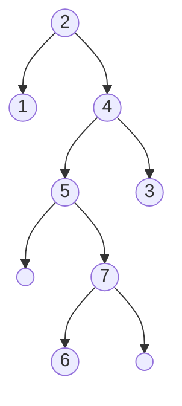

Un [[Árbol]] binario es un árbol de grado $n =2$: cada nodo puede tener hasta dos hijos.

Dos árboles binarios entre sí pueden ser:

1. **Distintos**: tienen una estructura diferente.
2. **Similares**: siguen una misma estructura pero tienen distinta información.
3. **Equivalentes**: misma estructura y misma información.
4. **Completos**: cada nodo tiene o dos hijos o ningún hijo. Almacenan como máximo $n = 2^h -1$ nodos (donde $h$ son los niveles del árbol).

## Árboles de Expresión

Las hojas son **operandos** y los nodos son **operadores**.

Los árboles binarios se pueden recorrer en **en-orden**: calcula la expresión sin separadores. En este ejemplo, sería `a + b * c + d * e + f * g`.

## Árboles Binarios de Búsqueda

Para todo **ABB** debe cumplirse que para todo nodo del árbol: 

$$elementos \ del \ hijo \ izquierdo < nodo \ propio < elementos \ del \ hijo \ derecho$$

Para **insertar elementos**: si es menor que el nodo va a la izquierda, si no va a la derecha. De esta forma, la búsqueda de un elemento es eficiente porque no necesita recorrer todos los nodos.

## Árboles Adelson-Velskii y Landis

Un árbol **AVL** es un árbol ABB cuya diferencia entre las alturas de sus subárboles es máximo 1. Esto asegura una profundidad de árbol $O(log(n))$. Formalmente, sea $H$ una función recursiva que calcula la altura de un árbol, $T_i$ el árbol izquierdo y $T_d$ el árbol derecho:

$$T \ es \ un \ AVL \iff T_i, T_d \ son \ AVL \land |H(T_i) - H(T_d)| \le 1$$

Se cumple que un árbol vacío es AVL.

### Factor de Equilibrio

$$FE = H(T_d) - H(T_i)$$

Para un AVL el factor de equilibrio debe ser -1, 0 o 1. Si $FE \ge 2 \implies$ es necesario reequilibrar.
