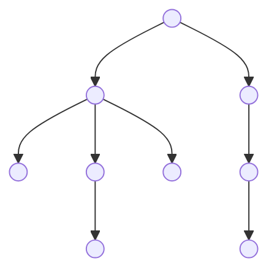

Un **árbol** es una estructura de datos [[Recursividad|recursiva]] y **estrictamente jerárquica** con un conjunto **dinámico** de nodos. Sirve para representar árboles genealógicos, estructuras de carpetas. 

El **grado** de un nodo padre es la cantidad de nodos hijos que tiene. El grado de un árbol es el grado de su nodo de mayor grado. Las **hojas** del árbol son los nodos sin hijos. El **nivel** de un árbol es la longitud del camino de longitud máxima que se pueda trazar desde la raíz hasta una hoja.

Sea un árbol n-ario de grado $n \ge 1$ donde cada nodo padre tiene como mucho una cantidad $n$ de hijos. **El número máximo de nodos en el nivel $i$ es $n^i$**. Un árbol **unario** es equivalente a una [[Lista]]. 

Un caso especial de árbol muy interesante es el [[Árbol Binario]].

## Recorrido

Para recorrer un árbol (siempre de izquierda a derecha) hay varias maneras:

1. **Pre-orden**: primero evalúa el nodo propio y luego recorre sus hijos.
2. **Pos-orden**: va primero hacia todos los hijos del nodo y luego evalúa el nodo propio.