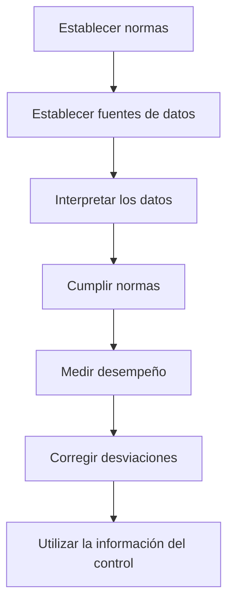

El control consiste en **medir el progreso hacia los objetivos**, asegurarse de que las acciones se ejecuten según los planes previstos (al [[Planificar]]) y dentro de los límites de la organización (al [[Organizar]]).

Implica también tomar **medidas correctivas**, lo que presupone un [[Proceso de Retroalimentación]].

> El control consiste en comprobar si todo funciona de acuerdo al plan adoptado, las instrucciones dadas y los principios estabecidos. Tiene la finalidad de localizar deficiencias y errores para rectificar y prevenir su recurrencia. - Henry Fayol.

4 elementos del control:

1. Relación con lo planeado.
2. Medición.
3. Detección de desvíos.
4. Medidas correctivas.

Según Peter Drucker, se caracteriza por:

1. **Economía**: cantidad no es calidad.
2. **Significatividad**: que haya congruencia entre los objetivos y lo medido.
3. **Oportunidad**: frecuencia no es eficiencia.
4. **Operatividad**: que la información llegue al responsable del control.

## Tipos de Control

Según el ámbito o **alcance**:

1. **Parcial**: abarca solo un sector de la empresa.
2. **Total**: integra a todos los sectores.

Según el momento o **tiempo**:

1. **A priori o preventivo**: previene problemas.
2. **Concurrente**: se da mientras una actividad está en progreso.
3. **De retroalimentación**: es el más común, se da luego de la acción.

Según su naturaleza o **nivel**:

1. **Estratégico**: analiza la situación de la organización respecto de su entorno. Responde a los planes estratégicos. Es **posicional**.
2. **Táctico**: evalúa la gestión del área. Mide las posiciones operativas, comerciales, financieras, patrimoniales y económicas. Es **de gestión** y lo realizan los gerentes.
3. **Operativo**: consiste en regular las operaciones para **estabilizar las salidas** según lo programado. Lo hacen los supervisores de primera línea.
