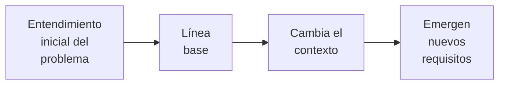

> Caminar sobre las aguas y desarrollar software a partir de la [[Especificación de Requisitos de Software]] es fácil, si ambas están congeladas.

Los [[Requisitos de Software]] cambian a través del tiempo: son **volátiles**. Por esto, como parte de la [[Ingeniería de Requisitos]], es importante gestionar su cambio.

**Línea base**: es una imagen en el tiempo que representa los requisitos acordados para el release actual (define un _milestone_ a cumplir). Es una declaración del estado de los requisitos en cierto momento.

![[Linea Base de Requerimientos.png]]

Relaciones posibles entre dos requisitos:

1. **Conflicto**: hay una contradicción que los hace incompatibles.
2. **Dependencia**: uno depende del otro.
3. **Redundancia**: sobra uno de los dos.
4. **Independencia**.

La línea base se utiliza como punto de partida para los cambios que se soliciten realizar. La línea base es el contrato, y cambiarla significa negociar nuevamente. **Todo cambio tiene un precio**.

![[Gestión de Cambios en los Requisitos.png]]

## Habilidades de Equipo

Se necesitan 6 habilidades de **equipo** para la gestión de requisitos:

1. **Analizar el problema**: definirlo, hallar sus [[Resolución de Problemas#Causas|causas]], determinar stakeholders y el [[Alcance]].
2. **Entender las necesidades**.
3. **Definir el sistema**: la visión y la ERS.
4. **Administrar el alcance**: negociar una línea base, priorizar, estimar esfuerzo y [[2do Nivel/Análisis de Sistemas de Información/Riesgo|Riesgo]].
5. **Refinar la definición del sistema**.
6. **Construir el sistema correcto**.
