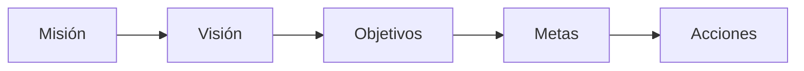

Buscamos entender a la organización, su estructura, y sus actores. El **modelado del negocio** nos permite acercarnos al [[Negocio Detrás del Sistema]] para comprender sus problemas actuales y potenciales. Se debe evaluar el impacto del cambio que el nuevo software representa, teniendo en cuenta que el SI debe adaptarse a la organización y no la organización al SI.

Como la primera parte del [[Modelado de los Sistemas]], el modelado del negocio identifica y representa:

1. *Objetivos* de la organización.
2. *Procesos* y sus *actividades*.
3. *Reglas de negocio* que regulan su funcionamiento.
4. *Objetos* (datos o documentos).
5. *Actores* (personas) que tienen un *flujo de trabajo*.

Podemos modelar el negocio orientado al valor/cliente, o a la actividad/rol.

En una organización, existen **procesos**:

1. **Estratégicos**: definen y controlan metas, políticas, y estrategias.
2. **Operativos**: aportan valor al cliente, generan el producto o servicio que se usa.
3. **Logísticos**: dan apoyo a los otros procesos. Gestión de recursos, mantenimiento, etc.

La filosofía de una organización se plasma en su SI. En particular:

- La *visión* describe una expectativa ideal a largo plazo si todo fuera bien.
- La *misión* describe la razón de ser de la organización.
- Los *objetivos* establecen resultados a lograr. Se subdividen en *metas* a alcanzar, lo que permite medir el progreso. Para lograr esos objetivos se deben poner en marcha procesos de negocio.
- Para cada *acción* de esos procesos, se deben asignar responsables, recursos, etc.

Una organización tiene necesidades de:

1. **Información**.
2. **Procesos**.
3. **Personas**.

A veces NO es necesario modelar el negocio, por ejemplo cuando:

- Ya se tiene [[Conocimiento]] previo.
- La complejidad del software es pequeña.
- Hay muy buena documentación preexistente.
- Estamos muy apurados y no hay tiempo.

## Diagrama de Actividad

Definido en UML, el diagrama de actividad relaciona una **secuencia de actividades** con **actores** e **información**.

![[Diagrama de Actividad.png]]
