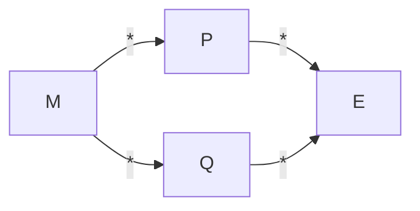

En el [[Cálculo Lambda]], la **semántica operacional** indica que la evaluación de una expresión es una serie de pasos de reducción donde cada paso siguiente se obtiene por reescritura. Una **reducción** tiene la forma $f(x) = E[x] \implies f(u) = E[x := u]$ de manera que cada aparición de $x$ en la expresión se sustituye por $u$.

Dada una expresión reducible $E$, cada reducción de $E$ reemplaza una _redex_ (_reducible expression_) de acuerdo a ciertas reglas. Existen 4 tipos de reducciones lambda:

1. **$\delta$-reducción**: transforma **constantes** evaluando operadores. Ejemplo: $* \ 3 \ 3 \rightarrow \delta \ 9$.
2. **$\alpha$-reducción**: renombra variables ligadas de expresiones $\lambda$. Matemáticamente, sea $\lambda x . M \overset{\alpha}{\rightarrow} \ \lambda y [x := y] \ M$ si $y \notin Free(M)$. Esto desambigua identificadores iguales pero en distintos [[Variables#Ámbito|ámbitos]], lo que asegura una **sustitución segura** para evitar problemas en la captura de variables. Ejemplo: $\lambda x (\lambda x . x) \overset{\alpha}{\rightarrow} \ \lambda x  ( \lambda y . y ) x$.
3. **$\beta-$reducción**: sustituye el argumento sobre el cuerpo de la función, reemplazando todas las ocurrencias de la variable instanciada. $(\lambda x . M) \ N \overset{\beta}{\rightarrow} [x := N] \ M$. Esto aplica un argumento, lo que es similar a llamar la función. Ejemplo: $(\lambda x . * \ x \ x) \ 2 \overset{\beta}{\rightarrow} (* \ 2 \ 2)$.
4. **$\eta$-reducción**: dos funciones son lo mismo si dan el mismo resultado para todos sus argumentos. Matemáticamente, $\lambda x . M \ x \overset{\eta}{\rightarrow} M$ si $x \notin Free(M) \land M$ es función. Ejemplo: $(\lambda x . (\lambda y . y)) \ x \overset{\eta}{\rightarrow} \lambda y . y$.

Un **redex** es un término de la forma $(\lambda x . M) N$. Dada una $\lambda$-expresión, se dice que está en forma normal si no contiene redexs. No toda $\lambda$-expresión admite una forma normal. Por ejemplo: $(\lambda x . x \ x)(\lambda y . y \ y) \overset{\beta}{\rightarrow} (\lambda y. y \ y)(\lambda y. y \ y) \overset{\beta}{\rightarrow} \ ...$

## Órdenes de Reducción

El orden en el que se aplican las reducciones, similar al [[Abstracciones#Orden de Evaluación|orden de evaluación]], puede ser:

- **Impaciente**: se reduce desde dentro hacia fuera. Esto permite algunos bucles infinitos.
- **Perezoso**: se reduce desde lo externo hacia dentro. El orden perezoso **siempre termina**.

## Teoremas de Church-Rosser

### Confluencia

$$\forall \ \lambda \text{-expresión} \ M \ / \ M \overset{*}{\rightarrow} P \land M  \overset{*}{\rightarrow} Q \implies \exists \ \lambda \text{-expresión} \ E / \ P \overset{*}{\rightarrow} E \land Q \overset{*}{\rightarrow}  E$$

Si $M$ admite forma normal $E$, esta es única salvo que se aplique una $\alpha$-reducción (un renombramiento).

### Terminación

$$\text{si } M  \overset{*}{\rightarrow} P \land P \text{ en forma normal} \implies \exists \ M  \overset{*}{\rightarrow} P \text{ en orden normal}$$

El orden perezoso **siempre termina**.
