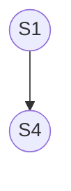

¿Qué pasa si la secuencia de instrucciones puede no seguir el mismo orden?

- **Ejecución secuencial**: da resultados idénticos y es independiente de la velocidad.
- **Ejecución concurrente**: actividades superpuestas en el tiempo que requieren **sincronización**.

Sea una sentencia $S_i$ con un conjunto de lectura $R(S_i)= \set{a_1, a_2, ..., a_n}$ de las variables leídas y un conjunto de escritura $W(S_i)=\set{b_1, b_2, ..., b_m}$ de las variables mutadas. Dos sentencias $S_i$ y $S_k$ pueden ejecutarse concurrentemente de manera **idempotente** (que se ejecuten siempre en el mismo orden) sí y solo sí se cumple $R(S_i) \cap W(S_k) = W(S_i) \cap R(S_k) = W(S_i) \cap W(S_k) = \emptyset$. Esta **condición de concurrencia** establece como necesaria la restricción de **escritura exclusiva**.

## Grafos de Precedencia

Este tipo de grafo es un grafo sin ciclos donde cada nodo representa una única sentencia o conjunto secuencial de instrucciones agrupadas.

![[Procesos Concurrentes 2024-12-08 14.59.24.excalidraw.svg]]

## Fork/Join

Un **fork** divide el flujo de control en dos [[Hilos]]. Luego, un **join** permite unir varios threads en uno solo.

![[Procesos Concurrentes 2024-12-08 15.06.05.excalidraw.svg]]

## Coben/Coend

Todas las instrucciones ubicadas entre **cobegin** y **coend** se ejecutan concurrentemente. Esto es más fácil de usar que un fork/join, pero hay grafos que este enfoque sencillo no puede resolver.

![[Procesos Concurrentes 2024-12-08 15.12.16.excalidraw.svg]]

## Parbegin/Parend

Similar a cobegin/coend pero para paralelismo.
