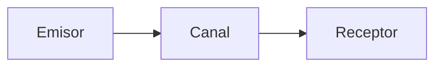

Existen varias soluciones por software para la[[Comunicación entre Procesos]].

## Variable de Cerradura

![[Diagrama de Variable de Cerradura.png]]

- Espera activa.
- El **lock** asegura exclusión mutua.
- Problema: dos procesos pueden acceder a la cerradura al mismo tiempo.

## Algoritmo de Decker

1. Primer intento: usa una variable de cerradura alternante (con un número para cada proceso).
2. Segundo intento: levanta una señal luego de mirar la señal del otro proceso. Problema: dos procesos pueden entrar a su sección crítica a la vez.
3. Tercer intento: levanta la señal antes de mirar las otras señales. Problema: los dos procesos pueden creer que el otro entró a su sección crítica, lo que provoca un [[Interbloqueos|interbloqueo]].
4. Cuarto intento: ahora baja la señal si la levantó pero ya habían otras levantadas. Problema: no asegura acceso a la sección crítica en un tiempo finito.

## Algoritmo de Peterson

![[Diagrama del Algoritmo de Peterson.png]]

- Usa la señal de Decker junto a una variable de cerradura que representa el "turno" para el siguiente proceso.
- Cumple con todas las condiciones para ser una solución efectiva.
- Mantiene la **espera activa** (desventaja).

## Otras Estrategias

### Dormir y Despertar

![[Diagrama de Dormir y Despertar.png]]

Un hilo **productor** escribe a un buffer y se duerme cuando ese buffer se llena. Otro hilo **consumidor** se despierta cuando hay algo en el buffer para leer. Este enfoque separa responsabilidades: un hilo escribe y el otro hilo lee.

### Semáforos

Un **semáforo** permite al consumidor y productor ejecutarse de forma concurrente.

![[Diagrama de Semáforos.png]]

- Variables: full (entradas ocupadas), empty (entradas libres), mutex (cerrojo).
- Operaciones: **DOWN**: si el semáforo es mayor a cero, entonces se decrementa y sigue. Sino, se duerme. **UP**: incrementa el valor del semáforo.

### Monitores

Es un concepto específico al **lenguaje de programación**. Los compiladores o runtimes no permiten que un proceso entre al monitor si existe otro en él (concepto mutex). El monitor tiene dos variables (*wait* y *signal*) y una cola de procesos en espera.

![[Diagrama de Monitores.png]]

### Paso de Mensajes

El paso de mensajes es útil para **entornos distribuidos** o de múltiples procesadores. El esquema básico es el siguiente:

El **direccionamiento** puede ser:

1. **Directo-simétrico**: se establece una conexión donde ambos procesos se conocen.
2. **Directo-asimétrico**: una conexión única en la cual solo el emisor conoce al receptor.
3. **Indirecto**: los mensajes se envían a y son leídos de **colas** o buzones.
	- **Buzones**: dos procesos se comunican si comparten un buzón del [[Sistema Operativo]].
	- **Puertos**: para que muchos emisores envíen a un receptor.
