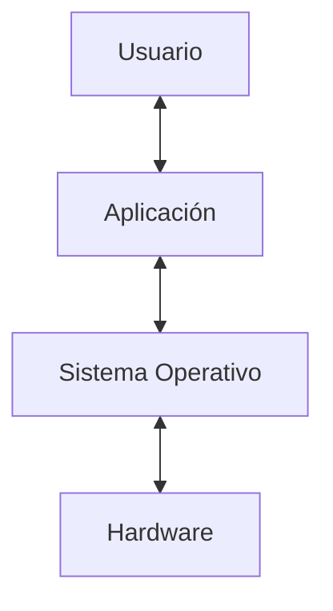

Un **sistema operativo** funciona como interfaz entre el usuario y el hardware, siendo también un **administrador de recursos** de memoria, CPU, archivos, y entrada/salida.

Los objetivos son comodidad, eficiencia, y capacidad de evolución. Las tareas que realizan consisten en gestionar recursos, garantizar accesos, controlar procesos, y corregir errores.

## Tipos de Sistemas Operativos

- Por lotes: batch.
- Multitarea: múltiples procesos.
- De tiempo real: tiempos de respuesta cortos.
- Paralelo: múltiples CPUs.
- Distribuido.
- De red.
- Cliente-servidor.
