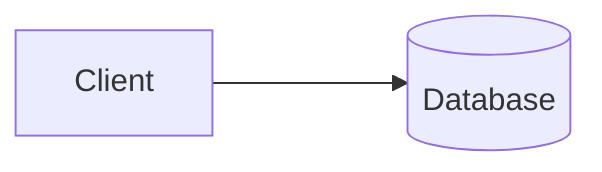
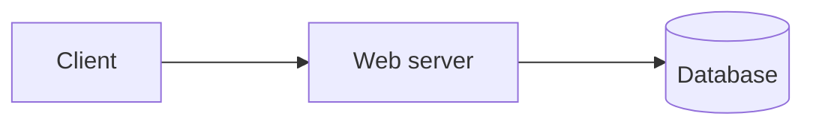
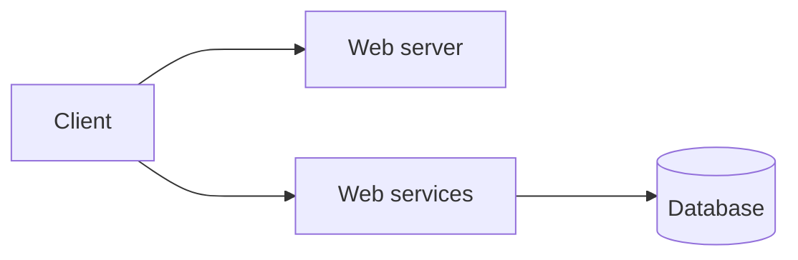

Una aplicación cliente que se conecta a un servidor se puede desarrollar de varias maneras y tener distintos niveles de complejidad, dependiendo de cuantas responsabilidades caigan en el lado del cliente. Hay varios tipos de cliente:

![[Aplicaciones de Cliente.png]]

**Fat Client**: el cliente se encargaba del procesamiento de los datos y de la lógica de negocio. Esto se usaba antes en aplicaciones de escritorio y con almacenamiento mayoritariamente local.

**Slim Client**: se agrega un [[Web Services|web server]] intermedio, implementando el patrón MVC, para la separación de responsabilidades. Esto permite clientes más livianos (con menor complejidad).

**Rich Client**: se agrega mayor complejidad al cliente para mejorar la experiencia de usuario. El mejor ejemplo es una Single Page Application (SPA) que, si bien primero consume al web service para obtener el HTML + JS + CCS inicial, luego consume el JSON de una [[RESTful API]].

## Estándares Web

En la web, los clientes son los navegadores. Existen tres tecnologías estandarizadas para crear aplicaciones de cliente para la web: HTML, CSS, y JavaScript.

**HTML** (Hypertext Markup Language) permite estructurar información de manera jerárquica y semántica. Los browsers interpretan archivos `.html` para componer textos, imágenes, páginas.

**CSS** (Cascading Style Sheets) son conjuntos de parámetros que describen la presentación visual del HTML. Un browser, al interpretar archivos `.css`, cambia la manera de renderizar los archivos `.html` (cambia los colores, márgenes, animaciones, etc) sin cambiar su semántica.

**JavaScript** es un lenguaje multiparadigma de alto nivel y tipado dinámico. Permite añadir dinamismo a los archivos `.html` y `.css` para crear páginas mucho más interactivas.

Estos tres estándares de la web van acompañados de muchos frameworks, estándares, y herramientas que facilitan el [[Desarrollo de Software]]. Algunos son:

1. TypeScript: una especie de _super-set_ de JavaScript que agrega un sistema y control de tipos.
2. `XMLHttpRequest`, `AJAX`, `fetch()`, `Promise`, etc: facilitan realizar peticiones a servidores.
3. Frameworks SPA: permiten evitar refrescar la página (crear un rich client). Ej: React, Angular.
4. CORS: mecanismo que permite a los servidores indicar orígenes (dominios) permitidos.
