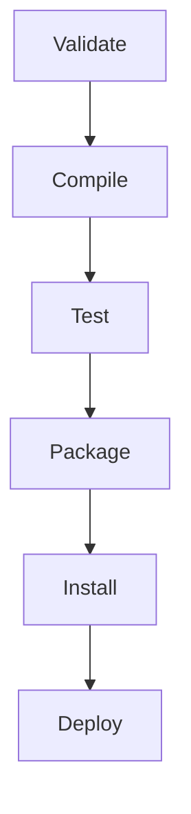

En el desarrollo de software, se deben tener en cuenta una gran variedad de tecnologías y factores para construir una aplicación funcional y robusta.

**12 factores de una aplicación**:

1. Codebase.
2. Dependencies.
3. Configuration.
4. Backing services.
5. Build $\rightarrow$ release $\rightarrow$ run.
6. Processes.
7. Port binding.
8. Concurrency.
9. Disposability.
10. Dev/stage/prod parity.
11. Logs.
12. Admin processes.

Tipos de **arquitectura** de una aplicación:

1. **Monolítica**: la lógica se encuentra completamente en un mismo lugar, junto a las vistas y los datos.
2. **Cliente-Servidor**: hay un cliente que envía peticiones a un servidor que las responde. Puede haber arquitecturas de:
   - **Dos capas**: cliente $\rightarrow$ [[Base de Datos]]. La lógica puede estar en ambos.
   - **Tres capas**: presentación (vistas) $\rightarrow$ aplicación (lógica) $\rightarrow$ base de datos (datos).
3. **Otros**: microservicios, basado en la nube, serverless, orientado a eventos, etc.

## Project Lifecycle Management

Los proyectos de desarrollo grandes contienen muchos módulos y librerías (dependencias) que se deben gestionar. Se vuelve complejo construir (_build_) el software de manera manual, por lo que se prefiere utilizar una _herramienta de administración de proyectos_.

Por ejemplo, en Java, **Maven** (o su alternativa Gradle) ayuda a:

- Gestionar dependencias de repositorios remotos o locales.
- Buildear el artefacto.
- Documentar el proyecto.
- Definir metadatos del proyecto.

Todo esto definido en un archivo `pom.xml` (el _Project Object Model_).

El resultado del _build lifecycle_ es un _artefacto_ (un software ejecutable) **versionado**.

