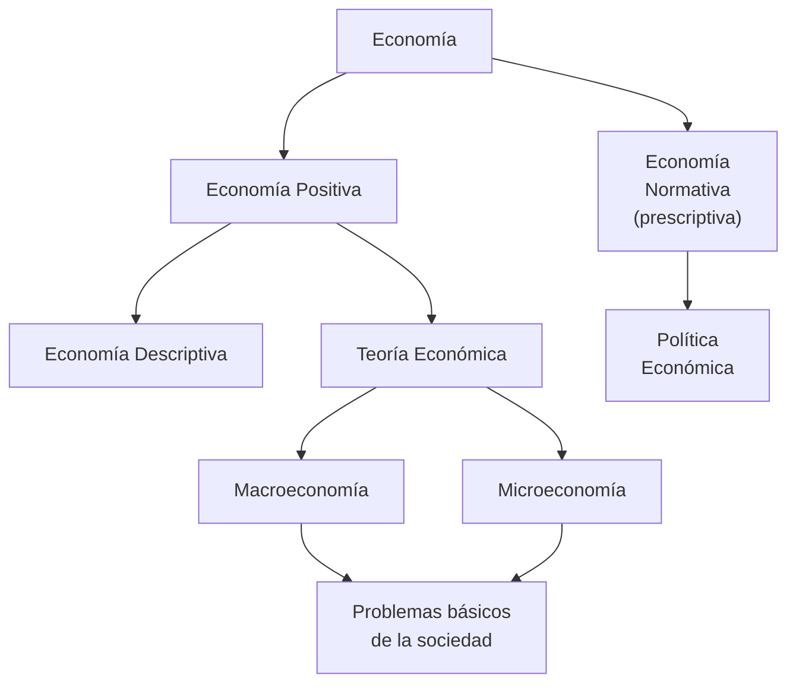

_Economía_ viene del griego _oikos_ (casa) y _nomos_ (administración). El campo de estudio de la economía es el dilema necesidades-bienes.

El _problema económico_ de toda sociedad fue y será distribuir los recursos de forma que satisfaga el número máximo de necesidades. Este problema surge de la **escasez**.

Alguien que "piensa como economista" solo toma una decisión cuando los beneficios superan a los costos. La existencia de alternativas de elección hace que el **costo de oportunidad** de una decisión sea el valor de la alternativa más valiosa no elegida.

De la **teoría económica** surgen principios, leyes y modelos que nos permiten responder preguntas del futuro. Su validez está ligada a la capacidad de predicción que los modelos tengan. Lo malo es que las teorías económicas no pueden ser experimentadas o probadas.

Una _ley_ expresa regularidades de una serie de datos. Las _teorías_ organizan leyes y facilitan la comprensión de su funcionamiento. Los _modelos_ se basan en teorías para realizar estimaciones.

Estas leyes no son 100% precisas, pero su utilidad es innegable.

Se usan dos enfoques en la teoría económica:

- **Micro**: estudia el comportamiento y toma de decisiones de individuos, empresas, etc.
- **Macro**: estudia el funcionamiento general de la economía, inversiones, producción, etc.

Un **bien económico** es todo lo que sea útil para satisfacer necesidades y esté disponible. Se clasifican de varias maneras:

- Según su relación con el ingreso: inferior, normal, o superior.
- Según su relación con otros bienes: sustitutos o complementarios.
- Etc...
