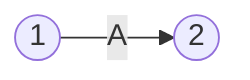

Un [[Proyecto]] se puede representar de varias maneras. La más básica de todas consiste en una tabla con todas las tareas y sus precedencias:

| Tarea | Precedencia |
| ----- | ----------- |
| A     | -           |
| B     | A           |
| C     | A           |
| D     | B, C        |

También se puede utilizar una matriz en la cual las tareas filas preceden a las tareas columnas:

|       | **A** | **B** | **C** | **D** |
| ----- | ----- | ----- | ----- | ----- |
| **A** |       | 1     | 1     |       |
| **B** |       |       |       | 1     |
| **C** |       |       |       | 1     |
| **D** |       |       |       |       |

Se puede identificar que A es la tarea inicial por no tener precedencias, y que D es la tarea final por no ser precedencia de ninguna otra tarea.

## Representación en Red

La representación en red o diagrama de Pert consiste en mostrar el proyecto usando recursos gráficos.

La tarea `A` se identifica con los nodos `1-2`. El nodo `2` refleja que la tarea `A` terminó.

## Método de los Potenciales

Se cambia la representación gráfica del proyecto para solucionar problemas al tener que rediseñar la red.

![[Representación de un Proyecto 2025-03-29 17.29.34.excalidraw.svg]]

En este ejemplo, las tres actividades principales se pueden subdividir en tres partes (1, 2 y 3) dado que no es necesario el 100% terminado de una actividad para iniciar la siguiente.

Este método no requiere actividades ficticias. Es mucho más simple de construir y modificar, pero también es más fácil de leer por quien no conoce un sistema de programación secuencial de actividades.
