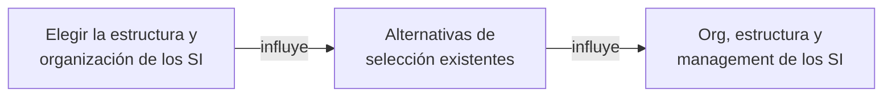
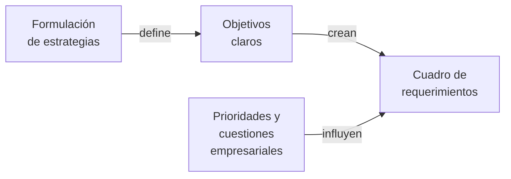

Las **estrategias de SI se concretan al definir políticas** que guíen la toma de decisiones. El aspecto más directo de cómo implementar una estrategia de SI está dado por las opciones y elecciones hechas al **adquirir SW y HW y seleccionar RRHH**. Elegir es **asignar recursos** de la manera más favorable posible.
![[Provisión de SI y TI 2024-05-09 12.41.59.excalidraw]]

La **administración de recursos** está interesada en la [[Provisión de SI y TI]] por cuestiones como:
- Impacto de los paquetes de SW en el proceso de selección y en la empresa.
- Conceptos de *downsizing* y *sistemas abiertos* que forman el paralelo tecnológico del tema empresarial y de la computación controlada por usuario.
- Provisión externa de los elementos de un SI (*outsourcing*).
$$ElementosDeUnSI = SW + HW + Servicios$$

Dada la complejidad de los SI actuales, no existe un organismo encargado de la [[Selección de SW y HW]] (sector tradicionalmente conocido como "Procesamiento de Datos"), sino que hay una **red de grupos** con relación lógica.

![[Provisión de SI y TI 2024-05-09 12.52.00.excalidraw]]

Siempre se parte desde el **problema empresarial** para **solucionarlo mediante SW y HW**. La jerarquía es: **necesidad empresarial > SW de aplicaciones > SW de sistemas > HW**. No hay que cambiar sin razón, y cuando sí hay que cambiar es mejor hacerlo de manera **simple** y buscando la **flexibilidad**.

Una decisión esencial es determinar el [[Canal de Obtención de SW]] más adecuado. La [[Adquisición de HW]] es más simple.

## Resumen

![[Proceso de Provisión de SW y HW 2024-05-11 12.24.45.excalidraw]]

## Concreción de la Solución Mediante la Fuente Seleccionada

Hay tres posibilidades para adquirir elementos de un SI:
- **Adquisición**: **menores costos** y **rápida disponibilidad** con una calidad conocida y comparable. Requiere adecuar las funcionalidades de los [[Paquetes Estándar]] a los [[Requerimientos de un SI]] de la organización. Es la única posibilidad para la [[Adquisición de HW]]. 
- **Desarrollo**: el [[Desarrollo Interno de SW]] es apropiado cuando la necesidad empresarial consiste en obtener **ventaja competitiva**. Requiere un **control efectivo** del proyecto de desarrollo, y el mayor costo estará en el proceso de codificación. Ofrece mejor **mantenimiento y especificidad**.
- **Outsourcing**: el [[Outsourcing]] **transfiere a terceros** la responsabilidad de proporcionar un servicio adaptado a nuestras necesidades.

La salida de esta etapa es la **solución definitiva**.