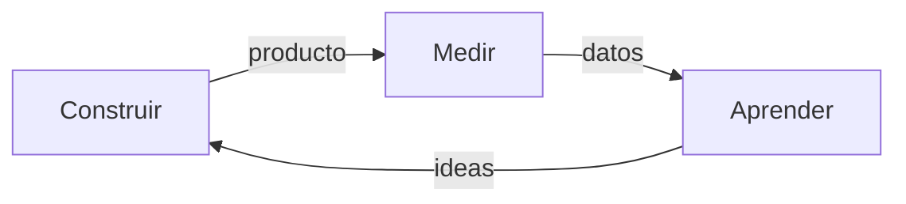

**Lean Startup** (propuesta de Eric Ries) surge para solucionar los problemas de una [[Startup]] de manera sistemática, aplicando varios principios de la [[Agilidad]].

Principios:

1. Los emprendedores están en todos lados.
2. El emprendedurismo es gestión.
3. Aprendizaje validad.
4. Build, measure, learn.
5. Contabilidad de la innovación.

Este tipo de disciplinas permite tener un marco conceptual/teórico con el que enfocar la práctica. Ofrece un **enfoque sistémico** por sobre ideas maravillosas.

Las ideas se tienen que contar para ser validadas, así que hay que saber contarlas de manera efectiva. La técnica del *elevator pitch* sirve para esto

Con Lean Startup, buscamos crear una [[Organización]], no solamente un producto. Los inversores prefieren apostar a un buen equipo por sobre una buena idea. Las personas por sobre el producto, porque eventualmente la startup va a encontrar el producto adecuado.

En lugar de hacer un plan de negocios extenso y detallado, en los entornos startup se propone hacer un [[Business Model Canvas]].

Las siguientes tres disciplinas se repiten de manera iterativa:

## Construir

**Construir** consiste en transformar ideas en productos. Un [[Producto Mínimo Viable]] en Lean Startup es el producto mínimo que permita **validar** la idea. Ejemplos de MVP:

1. Funcionalidad mínima.
2. Video explicativo.
3. Landing page (para ver si hay interés).
4. Concierge MVP (consiste en simular el servicio).

## Aprender

**Aprender** es averiguar si el modelo de negocio está bien. ¿Hay que pivotar o podemos continuar? *Pivotar* es cambiar el modelo de negocio, es cambiar la estrategia sin alterar la visión.

Tipos de **pivot**:

1. **Zoom in**: enfocarse en un negocio o característica específica del producto.
2. **Zoom out**: ampliar el propósito o agregar características al producto.
3. **Customer segment**: nos enfocamos en otro segmento.
4. **Customer need**: se descubren nuevas necesidades.
5. **Platform**: pasar de ser una aplicación a ser una *plataforma*.
6. **Business architecture**: por ejemplo, pasar de B2B a B2C.
7. **Value capture**: cambiar la manera de añadir valor.
8. **Engine of growth**: cambia el enfoque de crecimiento del negocio.
9. **Channel**: modificar el canal de entrega.
10. **Technology**: ofrecer la misma solución pero con otra tecnología.

Hay que **adaptarse al mercado**. Mientras menor sea nuestra inversión, más fácil y barato es pivotar hasta encontrar un modelo rentable que justifique esos pivots anteriores antes de quedarnos sin financiamiento.

Se debe descartar lo que no sirve y continuar lo que sí aporta valor.

