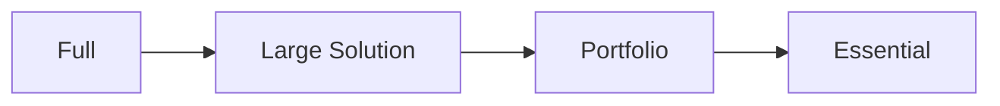

_Scaled Agile Framework_ (SAFe) es una propuesta que toma técnicas de la [[Agilidad]], de [[Lean]], y de [[DevOps]]. Aunque tiene muchas críticas por parte de la agilidad, es el framework más utilizado en las empresas para el [[Escalado de la Agilidad]].

Valores:

1. Respect for people.
2. Transparency.
3. Relentless improvement.
4. Alignment.

![[SAFe.png]]

SAFe tiene muchos pasos, niveles, prácticas, roles, y procesos propuestos. Es bastante **rígido**. Tiene muchas certificaciones y se define a si mismo como una metodología.

Niveles SAFe (de mayor a menor):

1. **Portfolio**: considera el conjunto de _value streams_ que alinea la estrategia a la ejecución.
2. **Large Solution**: para soluciones grandes y complejas que requieran coordinación.
3. **Program**: el equipo colabora en el Agile Release Train para el despliegue de infraestructura.
4. **Team**: roles del equipo.

Los niveles de configuración, desde la versión más completa hasta los elementos mínimos, son:

Para ejemplificar lo pesado que es SAFe, esta es su configuración full (la más completa):

![[SAFe Full.png]]

A nivel esencial, se propone una cultura de aprendizaje continuo y centrado en el cliente que requiere competencia en:

- LeanAgile leadership.
- Team and Technical agility.
- Agile product delivery.
- Enterprise solution delivery.
- Lean portfolio management.
- Organizational agility.

Críticas al modelo SAFe, varias realizadas por el resto de firmantes del [[Manifiesto Ágil]], quienes no creen que SAFe es una propuesta realmente ágil:

- Distancia al equipo del cliente, introduciendo burocracia e intermediarios.
- Introduce muchas reuniones de planificación.
- Agrega complejidad al desarrollo, en lugar de simplificarlo.
- Parece tan estructurado como el [[Rational Unified Process]].
