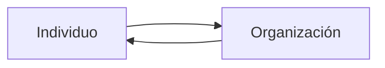

Hay una tendencia actual a pasar de desarrollar productos (que cualquiera puede hacer) a desarrollar servicios de software (específicos a cada empresa) con actualizaciones, seguridad, etc.

**Service Design** es una disciplina que aplica [[Design Thinking]] al diseño de servicios. Al diseñar estos servicios, buscamos entender el *customer journey*: el viaje del cliente a lo largo de su relación con nuestro servicio, el cual se plasma en un [[Customer Journey Map]].

Es conveniente tener una [[Design Persona]] para cada tipo de cliente.

Otras técnicas útiles para Service Design:

- **Service Ecosystem**: un servicio puede presentarse como un **ecosistema** para describirlo en capas. Es útil ver la **relación** de nuestro servicio con otros servicios adyacentes o cercanos. Este enfoque se termina implementando con herramientas y prácticas concretas.
- **Value Network Map**: es un modelo de **aporte de valor** a los clientes. Hay que tener clara la misión de nuestro negocio, y ajustar la propuesta de valor y el servicio tangible.
- **Service Prototypes**: prototipar el funcionamiento mediante mockups, simulaciones, etc.

Los ***alignment diagrams*** son mapas, diagramas, o visualizaciones que revelan ambos lados de la creación de valor. Hay varios tipos de alignment diagrams:

1. **Service Blueprints**: se limitan a describir el servicio.
2. **Customer Journey Maps**: hacen foco en el viaje emocional del cliente.
3. **Otros**: experience maps, mental model diagrams, spatial maps.

![[Service Blueprint.png]]

Se debe tener en cuenta todo el servicio, no solo la aplicación en sí. La **experiencia** del cliente respecto del servicio es mucho más amplia. Hay que identificar sus sentimientos positivos y negativos.

También se identifican acciones de los clientes y el resultado que esperan.

Los *momentos de verdad* son puntos específicos del viaje en el que sale o todo bien o todo mal: son **críticos**. Son similares a los puntos de conversión donde un usuario pasa de una categoría a otra: de suscripción free a premium, de mirar el catálogo a comprar el ítem.

