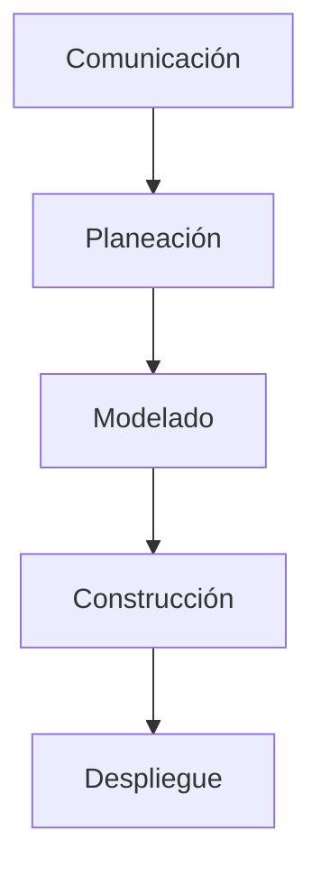

En 1968 se reúnen personas para establecer las primeras metodologías de cómo desarrollar software copiando procesos de otras ingenierías. Surge así la ingeniería de software.

> Es la aplicación de un enfoque sistemático, disciplinado y cuantificable al desarrollo, operación y mantenimiento de software - IEEE

> Software engineering is programming integrated over time - Google

[[Historia de la Ingeniería de Software]]. [[Disciplinas de la Ingeniería de Software]].

## Capas

Según Pressman, la ingeniería se construye sobre ciertas capas, una encima de la otra:

1. **Compromiso con la calidad:** es una cultura organizacional de mejora continua.
2. **Proceso:** define una estructura para el desarrollo racional y oportuno. Es el fundamento de la ingeniería.
3. **Métodos:** ofrecen la experiencia técnica necesaria para elaborar software.
4. **Herramientas:** apoyo automatizado para el proceso y los métodos.

## Proceso

El proceso busca que la ingeniería sea rentable y sostenible en el tiempo y en la escala del proyecto. Existen varios [[Ciclo de Vida]].
