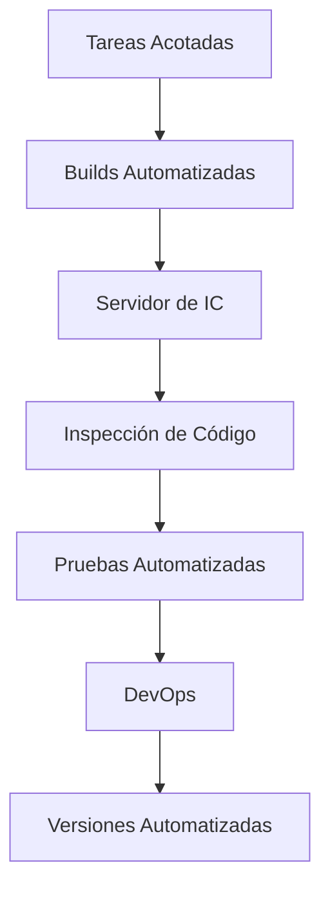

Es una **práctica** de desarrollo de software donde los miembros del equipo **integran su trabajo frecuentemente**. Todo integrante del equipo integra sus cambios al repositorio central **al menos una vez al día**, siendo los cambios una **funcionalidad nueva testeada automáticamente**. Similar al principio [[FAIL]], propone no tenerle miedo a los errores.

¿Cuánto se tarda una organización en pasar a producción un cambio de una línea de código? La integración continua intenta acortar los procesos burocráticos para poder cambiar software más fácilmente.

Se puede extender con [[Despliegue Continuo]] y [[Entrega Continua]]. Ejemplo:

![[Esquema de un Workflow de Integración Continua.png]]

## Madurez del Equipo

Es clave para hacer IC la madurez del equipo, pero algo como pruebas automatizadas es crucial para todo tipo de equipos.

## Build

Es la **combinación correcta de versiones** de los [[Gestión de la Configuración#Elemento de configuración|ECs]] de software, usando datos de configuración apropiados, para lograr un programa ejecutable. Cada integración se comprueba mediante un proceso de build automatizada.

- Debe ser **automatizada:** disparada por un evento pre-establecido.
- Es una **secuencia de tareas**: limpieza + compilado + pruebas + inspecciones + despliegue.
- Debe poder ser probada automáticamente.
- Debe ser **rápida** para que el proceso no demore y no se pierda productividad.

## Beneficios

1. **Reducir riesgos y tiempos** (minimiza los "delta changes" del código).
2. **Reducir tiempos** del proceso.
3. Construcción de la build mediante un **proceso conocido**.
4. **Confianza** en el equipo de desarrollo.
5. **Feedback** frecuente.
