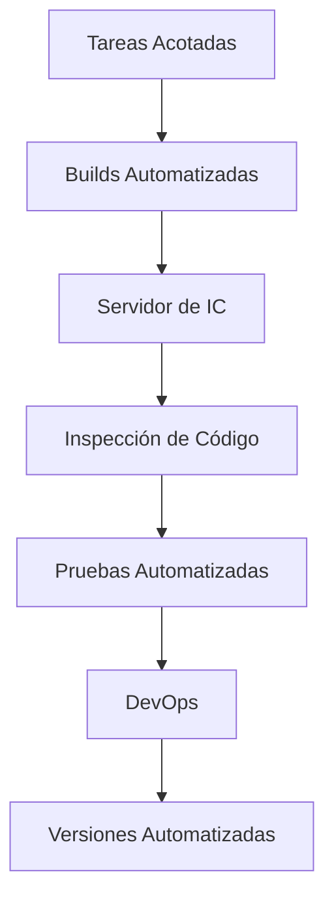

Todo integrante del equipo integra sus cambios al repositorio central al menos una vez al día, siendo los cambios una funcionalidad nueva testeada automáticamente. Similar al principio [[FAIL]], propone no tenerle miedo a los errores.

¿Cuánto se tarda una organización en pasar a producción un cambio de una línea de código? La integración continua intenta acortar los procesos burocráticos para facilitar el poder cambiar software.

Se puede extender con [[Despliegue Continuo]] y [[Entrega Continua]].

## DevOps

Flickr en 2009 presenta la idea de **DevOps**, un compromiso y balance entre los desarrolladores que quieren agilidad y cambios y los operadores que buscan estabilidad.

El negocio quiere ir rápido pero también quiere ir bien ==> se necesita buena calidad ==> el testing se vuelve fundamental.

## Madurez del Equipo

Es clave para hacer IC la madurez del equipo, pero algo como pruebas automatizadas es crucial para todo tipo de equipos.

## Build

Es la combinación correcta de versiones de los [[Gestión de la Configuración#Elemento de configuración|ECs]] para obtener una release.

- Debe ser **automatizada:** disparada por un evento pre-establecido.
- Es una secuencia de tareas: limpieza + compilado + pruebas + inspecciones + despliegue.
- Debe poder ser probada automáticamente.
- Debe ser rápida para que el proceso no demore y no se pierda productividad.
