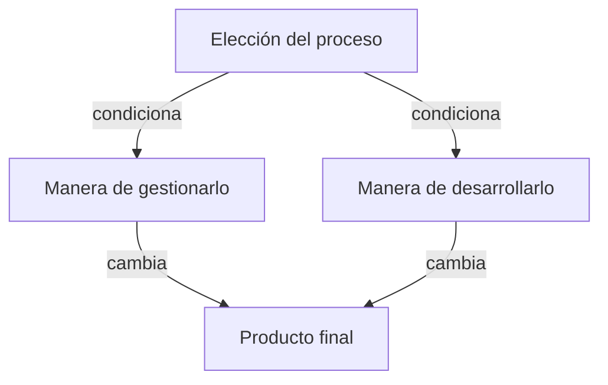

Es un acrónimo que se enfoca en los cuatro elementos más importantes a gestionar.
En este orden de importancia:

1. **Personas**.
2. **Producto**.
3. **Proceso**.
4. **Proyecto**.

## Personas

Son el principal activo del proyecto y llevan a cabo las actividades necesarias para asegurar el éxito o fracaso del proyecto.

En el _Management 1.0_, el _Taylorismo_ y la gestión clásica se propone la pirámide organizacional en la cual en el nivel estratégico se toman decisiones y en el nivel operativo solo se realizan órdenes, perspectiva que sirve para otras industrias pero no funciona en el software. En el software los desarrolladores constantemente toman decisiones de diseño.

Surge en el **Software Engineering Institute**:

- Modelo de la Madurez de la Capacidad de Gestión del Personal
- Modelo Integrado de la Madurez de la Capacidad del Software

### Participantes

- **Gerentes ejecutivos**: para marcar objetivos.
- **Gerentes técnicos de proyecto**: para planificar, motivar, controlar.
- **Profesionales**: con las habilidades técnicas necesarias.
- **Clientes**: que conocen los requerimientos del software.
- **Usuarios finales**: que utilizarán el software.

### Equipo

El equipo se debe organizar para maximizar las capacidades de cada persona.

Se clasifican en:

- **Descentralizado Democrático**: hay líderes por tarea y con consenso grupal. Sirve para problemas complejos.
- **Descentralizado Controlado:** jefes por área para problemas modularizables.
- **Centralizado Controlado**: solamente el jefe resuelve problemas.

![[Las 4 P 2024-07-11 00.02.30.excalidraw.svg]]

En todo equipo es importante la confianza, distribuir las tareas conforme a las habilidades de cada integrante, y conservar la cohesión.

El _Management 3.0_ y el _Peopleware_ proponen que lo importante es el equipo y que la organización se debe adaptar al equipo.

Los [[Equipo Ágil|equipos ágiles]]:

- Son multifuncionales, auto-organizados, pequeños y maduros.
- Conocen el impacto de la falta de calidad.
- Trabajan en un entorno de productividad.

## Producto

Conocer el **alcance** o **ámbito** implica conocer:

- **Contexto** organizacional.
- **Objetivos** de información.
- **Funciones** del software.
- **Restricciones** y rendimiento del software.
- **Usuarios** y clientes.

Según Pressman, el **ámbito** debe ser:

- **No ambiguo**: todos entendemos lo mismo.
- **Enunciado acotado**: ir parte por parte.
- **Limitaciones**.
- **Riesgos conocidos**.

Es importante una estrategia de **divide y vencerás** para descomponer el problema en partes más pequeñas.

## Proceso

Guía la manera de construir el producto. Hay que buscar un [[Ciclo de Vida]] o modelo de proceso que se adapte al producto y al equipo.

La **elección** del proceso condiciona la manera de **desarrollar** un proyecto y cambia la manera de **gestionarlo** $\implies$ cambia el **producto final**.

Un proceso **ágil** permite corregir más veces el producto con el cliente. Esto implica **gestionar más**.

## Proyecto

> El día a día del programador debe ir desde una **tarea** claramente conectada a una **característica** que el cliente necesita, y ello a un **test**, y a una **implementación inmediata**, teniendo en cuenta el **diseño.** - Kent Beck en XP Explained

Definido así hace 20 años en [[XP]], es la manera actual de trabajar en la industria.

### Economics of Software Development

Necesitamos desarrollo de software que sea económicamente más valioso de manera temprana y constante en su entrega. Teniendo en cuenta el triángulo de fuego, Kent Beck propone negociar (hacer variar) el alcance.

### Costos del Cambio

Hacer iteraciones más cortas permite identificar problemas más temprano y reducir el costo o pérdida asociado al defecto. La agilidad propone que la entrega constante aplane la curva del costo.

![[Las 4 P 2024-07-11 00.01.23.excalidraw.svg]]

En el desarrollo tradicional, el impacto de un error en producción es muy alto y costoso, mientras que en la curva propuesta por XP **el costo del cambio se aplana con el tiempo**. Esto solo se puede lograr con [[Calidad]] _built-in_, haciendo énfasis en buenas prácticas y [[Pruebas]].
