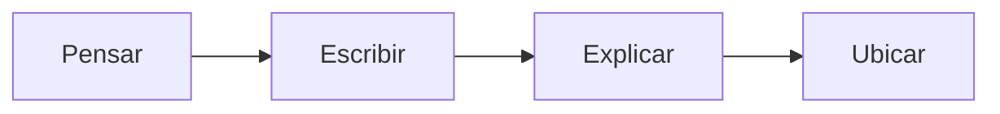

Es una **herramienta** para **organizar** el [[Product Backlog]] y es una aproximación a la organización y priorización de [[4to Nivel/Ingeniería y Calidad de Software/Historias de Usuario|Historias de Usuario]]. Ayuda al **descubrimiento** de nuevas HUs.

La idea es que **todo el equipo** y el cliente intervengan y discutan para generar un **entendimiento compartido** del producto que vamos a construir.

Una vez [[Product Backlog#Priorización|priorizado]] el MHU, se puede derivar el [[Producto Mínimo Viable]].

## Storytelling

Un mapa de historias de usuario hace **storytelling** de las necesidades del usuario y las funcionalidades de la app, en el orden en el que se usarían.

> Reorganizing cards together allows you to communicate without saying a word.

El MHU se lee:

- De **izquierda a derecha**: en secuencia del storytelling del usuario usando la aplicación. Esta es la **columna vertebral** del producto, normalmente no varía mucho.
- De **arriba a abajo**: en orden del funcionamiento del sistema, teniendo en cuenta dependencias. Es el **esqueleto andante**, que suele ser reorganizado y repriorizado.

![[Mapa de Historias de Usuario.png]]

## ¿Cómo se hace un MUP?

Patton propone para cada historia de usuario:

Es importante enmarcar la idea: qué es la funcionalidad y por qué se necesita. En base a eso: ¿cuál es su prioridad?

Se debe describir cada rol para **conocer a los usuarios**.
