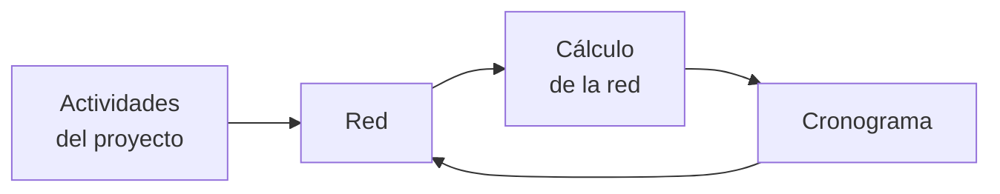

Los métodos CPM y PERT se basan en los [[Modelos de Redes]]:

- **CPM**: Critical Path Method.
- **PERT**: Program Evaluation and Review Technique.

Estos métodos nos ayudan en la [[Planificación y Control de Procesos]]. Un _proyecto_ es un conjunto de actividades interrelacionadas que consumen recursos.

1. Se definen las actividades, sus precedencias, y sus necesidades de tiempo.
2. El proyecto se traduce a una red.
3. Se utilizan cálculos específicos de redes.
4. Se deriva un **cronograma** o **planificación óptima** resultante.

El CPM supone duraciones determinísticas de actividad, mientras que el PERT supone duraciones probabilísticas. Hay dos reglas:

1. Cada actividad se representa con un y solo un arco.
2. Cada actividad se debe identificar con dos nodos distintos.

Una _actividad ficticia_ es una actividad artificial que sirve solamente para representar dos actividades concurrentes sin romper esas dos reglas. Una actividad ficticia no consume ni tiempo ni recursos.

## Técnicas de Gestión de Proyectos

Etapas del PERT:

1. Definir objetivos operativos.
2. Definir actividades.
3. Definir su secuencia.
4. Calcular su tiempo necesario.
5. Dibujar el diagrama.
6. Analizar el diagrama.

Un _suceso_ es el inicio o fin de alguna actividad. El suceso final es lograr el objetivo concreto dado. Una _holgura_ es la diferencia entre la fecha de inicio _temprana_ (hasta cuándo puedo demorar la tarea sin demorar todo el proyecto) y la fecha de inicio _tardía_ (qué tan rápido puedo hacerla lo antes posible). El _camino crítico_ es la secuencia de actividades que más tiempo consume.

$$T_\text{estimado} = \frac{T_\text{optimista}+4T_\text{probable}+T_\text{pesimista}}{6}$$

Estas técnicas se pueden aplicar en todo tipo de proyectos que exijan la **acción coordinada de personas responsables**. Ayuda al cálculo de tiempo y recursos, y muestra la **relación entre tareas**.

Ejemplo PERT:

![[Métodos CPM y PERT 2025-02-02 17.10.46.excalidraw.svg]]

Si $E_i = L_i \ \land \ E_j = L_j$, entonces la actividad $(i,j)$ pertenece a la **ruta crítica**, por lo que no admite demora.

Holguras:

1. Total: $H_t = L_\text{final} - (E_\text{inicial} + D)$. Las actividades de la ruta crítica no tienen holguras.
2. Libre: $H_l = E_\text{final} - (E_\text{inicial} + D)$.
3. Independiente: $H_i = E_\text{final} - (L_\text{inicial} + D)$.

| Actividad | $E_i$ | $E_f$ | $L_i$ | $L_f$ | $RC$ | $DUR$ | $E_i+D$ | $L_i+D$ | $H_t$ | $H_l$ | $H_i$ |
| --------- | ----- | ----- | ----- | ----- | ---- | ----- | ------- | ------- | ----- | ----- | ----- |
| A         | 0     | 2     | 0     | 10    | F    | 2     | 2       | 2       | 8     | 0     | 0     |
| B         | 0     | 5     | 0     | 5     | V    | 5     | 5       | 5       | 0     | 0     | 0     |
| C         | 2     | 10    | 10    | 18    | F    | 8     | 10      | 18      | 8     | 0     | -8    |
| D         | 5     | 12    | 5     | 12    | V    | 7     | 12      | 12      | 0     | 0     | 0     |
| E         | 5     | 8     | 5     | 12    | F    | 3     | 8       | 8       | 4     | 0     | 0     |
| F         | 12    | 18    | 12    | 18    | V    | 6     | 18      | 18      | 0     | 0     | 0     |

Siempre se cumple que $H_t \ge 0,\ H_l \ge 0, \ H_t \ge H_l \ge H_i$.

Otros diagramas alternativos a un diagrama de PERT:

- **Árbol de decisión**: muestra el encadenamiento de acciones necesarias.
- **Diagrama de flujo**: es un flowchart del funcionamiento de un servicio.
- **Diagrama de Gantt**: sirve como un calendario o cronograma para la ejecución del proyecto.
