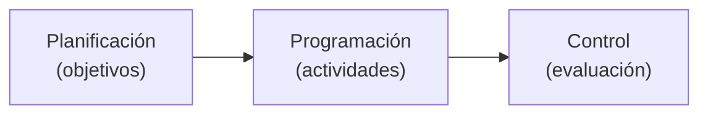

Los [[Métodos CPM y PERT]] ayudan para la planificación y control de procesos.

![[Planificación y Control de Procesos 2025-02-02 16.40.56.excalidraw.svg]]

Un **proyecto** o plan de operaciones es la especificación y cumplimiento, en un tiempo dado, de una serie ordenada de actividades que producirá un cambio mensurable en la capacidad de un sistema. Emplea recursos humanos y técnicos.

Los **objetivos operativos** del proyecto son el resultado perseguido por un equipo de trabajo. Su logro se ve limitado por tiempos y recursos.

Desarrollo del proyecto:

1. Identificar todas las actividades (¿Qué? ¿Cómo? ¿Dónde?).
2. Ordenarlas cronológicamente.
3. Identificar etapas previas a cada actividad.
4. Identificar las fechas de inicio y fin.
5. Precisar los recursos necesarios.
6. Especificar las responsabilidades.
7. Contactar a todos los implicados.
8. Identificar los problemas.
9. Coordinar las diferentes partes.

Beneficios de planificar un proyecto:

1. Etapas claramente definidas.
2. Obtención de resultados claros y a corto alcance.
3. Ejecución fácil.
4. Revitalizar organizaciones estabilizadas.
5. Facilita controles y evaluaciones.
6. Disposición a la participación.

Inconvenientes:

1. Superposición de acciones y recursos.
2. Problemas de mando por varias líneas jerárquicas.
3. Baja coordinación.
4. Diferencias entre el personal.
5. El control presupuestario complejiza procesos.
6. Desigualdades en la asignación de recursos.
7. Dificultades de integración posterior en las estructuras estables.
