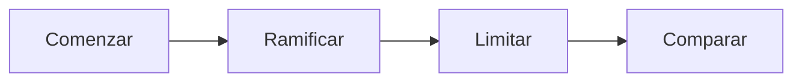

La **programación lineal entera** (PLE) es una caso especial de los problemas de [[Programación Lineal]](PL), que se formulan de igual manera que en PL pero con una condición agregada, dependiendo del tipo de modelo:

- **PLE pura**: todas las variables de decisión toman valores enteros.
- **PLE mixta**: solo algunas variables de decisión toman valores enteros.
- **PLE binaria**: todas las variables de decisión valen o cero o uno.

El PL obtenido al omitir todos los enteros o restricciones 0-1 en las variables se llama *relajación del PL* de la PLE. Cualquier problema de PLE se puede considerar como una relajación del PL con restricciones adicionales, por lo que la región factible del PLE está contenida en la relajación del PL asociada:

- Si es un problema de maximización: $z \text{ óptimo de la relajación del PL} \ge z \text{ óptimo del PLE}$.
- Si es un problema de minimización: $z \text{ óptimo de la relajación del PL} \le z \text{ óptimo del PLE}$.

Procedimientos para solucionar problemas de PLE (ninguno es consistentemente efectivo):

1. Método del plano de corte.
2. Método de ramificación y corte.
3. Método de ramificación y acote.

## Método del Plano de Corte

Se parte de la solución óptima del problema relajado de PL y se agregan restricciones (*cortes*) hasta producir un punto extremo entero. Ejemplo en el que primero se pasa un problema a la forma estándar:

$$\begin{align}\text{minimizar:} -3x-y \\
3x+4y+w_1&=20 \\
2x+y+w_2&=9 \\
x,y,w_1,w_2 &\ge 0\\
x,y &\in \Bbb Z
\end{align}$$

Resolución del problema relajado:

| $w_2$ | $y$ | $w_1$ | $x$ |      |
| ----- | --- | ----- | --- | ---- |
| -3/2  | 5/2 | 1     | 0   | 13/2 |
| 1/2   | 1/2 | 0     | 1   | 9/2  |
| 3/2   | 1/2 | 0     | 0   |      |

Hay valores en la solución óptima que no son enteros, por lo que agregamos una nueva restricción. Se elige la fila de una variable no entera, y se toma la parte entera de cada coeficiente. Eligiendo la fila del 9/2:

$$\left\lfloor \frac{1}{2} \right\rfloor w_2 + \left\lfloor \frac{1}{2} \right\rfloor y + \left\lfloor 0 \right\rfloor w_1 + \left\lfloor 1 \right\rfloor x \le \left\lfloor \frac{9}{2} \right\rfloor \implies x \le 4 \implies x + w_3 = 4 $$

Se obtiene una nueva restricción $x + w_3 = 4$. Resolviendo nuevamente por el método Simplex dual, se obtiene:

| $w_2$ | $y$ | $w_1$ | $x$ | $w_3$ |     |
| ----- | --- | ----- | --- | ----- | --- |
| -4    | 5   | 1     | 0   | 0     | 4   |
| 0     | 1   | 0     | 1   | 0     | 4   |
| 1     | -2  | 0     | 0   | 1     | 1   |
| 1     | 1   | 0     | 0   | 0     |     |

Se logra encontrar la solución óptima del PLE: $x=4,y=1,w_1=4$.

## Método de Ramificación y Acote

Este método es más eficiente que el anterior. Su funcionamiento básico es el siguiente:

1. Se resuelve el problema relajado de PL y se toma esa solución como una cota máxima.
2. A partir de ahí, se designa a una variable racional como entera y se investigan dos ramas: una redondeando la variable hacia abajo, y otra redondeando la variable hacia arriba.
3. Cada rama tiene una cota superior e inferior para descartar ramas subóptimas.
4. Se compara la solución de cada rama con el límite de referencia vigente.
5. Luego de examinar todas las ramas, nos quedamos con la mejor solución factible.

Ejemplo:

$$\begin{align}\text{maximizar: } z = x_1+5x_2+7x_3+3x_4 \\
\text{sujeto a: } 7x_1+3x_2+2x_3+4x_4 &\le 15 \\
8x_1+2x_2+3x_3+5x_4 &\le 17 \\
x_1,x_2 &\le 4 \\
x_3,x_4 &\le 1
\end{align}$$

![[Método de Ramificación y Acote.png]]

De todas las soluciones enteras encontradas, la óptima es $z=27$ con $x_1=0, x_2=4,x_3=1,x_4=0$.

## Problemas Típicos

Hay varios problemas que son típicos para la programación lineal entera. Por lo general, hay dos tipos especiales de restricciones:

- **Restricciones de no interferencia**: hay variables de decisión binarias excluyentes entre sí. La restricción $x_1+x_2\ge 1$ establece que no se puede elegir ambas a la vez.
- **Restricciones de dependencia**: se usan cuando una variable binaria debe elegirse sí o sí para poder elegir otra. Para que $x_1$ dependa de $x_2$, se define la restricción $x_1-x_2\le 0$, de manera que si $x_1=1 \implies x_2 = 1$.

Un problema de **presupuesto de capital**, también conocido como el problema del viajero, surge cuando hay que elegir en qué proyectos invertir dado un presupuesto fijo, o elegir qué objetos (cada uno con cierto peso) llevar en una mochila de capacidad limitada. Las variables binarias (invertir o no, llevar o no) tienen asociadas cierto costo/peso y cierto interés/importancia.

Un problema de **cobertura de conjunto** consiste en minimizar las ubicaciones en las que instalar o construir, asegurando cubrir todas las zonas. Se modela como un problema de PLE binaria donde cada zona debe ser cubierta por al menos una ubicación:

$$\sum x_i \ge 1: \text{una restricción por cada zona, siendo $x_i$ las ubicaciones que cubren esa zona}$$

Un problema de **cargo fijo** aparece cuando hay un uso mínimo de algún recurso, como cuando prender una máquina tiene un costo de preparación, o suscribirse a un servicio tiene un costo de instalación.

Estos casos se modelan como un problema de PLE mixta, donde hay variables binarias asociadas al costo inicial por la decisión de usar o no cada máquina/servicio, y variables normales asociadas al costo de uso unitario de cada máquina servicio:

$$\underbrace{ax_1+bx_2}_\text{costo unitario}+\underbrace{cy_1+dy_2}_\text{costo inicial}$$
