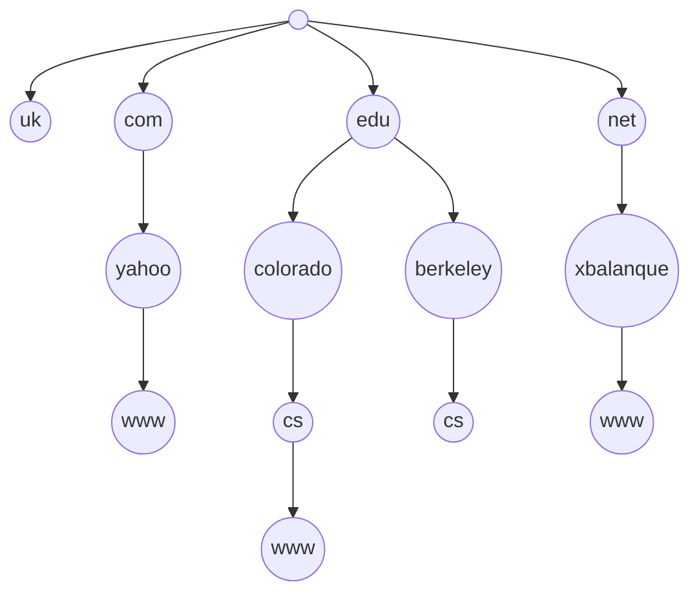

*Dynamic Naming Service* (DNS), definido en la RFC 1034, es un [[Protocolo]] de capa 7 que permite a las aplicaciones **recordar nombres** en lugar de direcciones [[IP]], lo que otorga flexibilidad, escalabilidad, y balance de carga.

Una aplicación pasa el nombre de host de destino al proceso DNS para obtener la dirección IP. Si el servidor DNS conoce la respuesta, le contesta. Si no, puede:

- Consultar al próximo servidor (método recursivo).
- Indicarle al cliente qué servidor consultar (método iterativo).

DNS es una base de datos distribuida implementada en una **jerarquía** de *name-servers*.



```
www.unam.edu.ar [root servers]
	|	 |   '-> TLDs: Top Level Domains
	|	 '-----> TLDs: Top Level Domains
	'----------> Authorative Domain Servers	
```

La **resolución de nombre** es un proceso iterativo para resolver la URL "www.unam.edu.ar":

1. El usuario ingresa el nombre del servidor. Lo busca en el *resolutor básico*.
2. El resolutor básico se conecta a un *resolutor iterativo* que ya conoce.
3. El resolutor iterativo solicita la IP a un servidor raíz en forma autoritativa.
4. El servidor raíz no tiene información autoritativa. Indica el servidor TLD a consultar.
5. El resolutor iterativo contacta a un *servidor autoritativo* de la zona `.ar`.
6. El servidor de `.ar` indica los *servidores de nombre* de la zona `.edu.ar`.
7. El resolutor iterativo contacta a un servidor autoritativo de la zona `.edu.ar`.
8. El servidor de `.edu.ar` indica los name-servers de la zona `unam.edu.ar`.
9. El resolutor iterativo contacta a un servidor autoritativo de la zona `unam.edu.ar`.
10. Este servidor es responsable de la información pedida. Da una respuesta autoritativa.
11. El resolutor iterativo le responde la dirección IP al resolutor básico.

Dado lo largo del proceso, normalmente el resolutor iterativo incluye una **memoria cache local** para guardar respuestas de servidores autoritativos.
