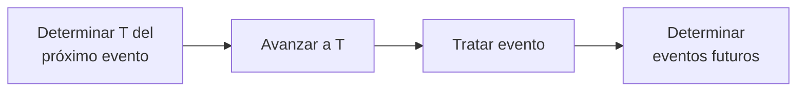

Al realizar una [[Simulación]] de [[Sistemas Discretos]] con la **metodología del avance del tiempo evento a evento**, se posee una lista con _eventos futuros_. Al procesar cada evento, se pueden generar nuevos _eventos futuros_. Avance del tiempo:

Flujo básico para cualquier simulación evento a evento:

![[Simulación con Metodología Evento a Evento 2025-01-29 17.06.54.excalidraw.svg]]

## Modelo de Línea de Espera con un Servidor (Cantidad de Personas)

Sea un puesto de atención al público con un tiempo de atención conocido. Puede existir un _arrepentimiento_ en función de la cantidad de personas en la cola.

- **Entidades**: personas que llegan para ser atendidas.
- **Estado del sistema**: $\text{NC}$ es la cantidad de personas en el sistema en un instante dado.
- **Eventos**: una _llegada_ condiciona una salida cuando $\text{NC} =1$. Siempre genera otra llegada futura. Una _salida_ condiciona una salida cuando $\text{NC} \gt 1$ (hay gente en la fila que todavía tiene que salir de la fila).
- **Variables exógenas de datos**: intervalo entre arribos $\text{IA}$ y tiempo de atención $\text{TS}$. En realidad, los datos son la **función de distribución de probabilidad** de ambas variables.
- **Variables exógenas de control**: no hay explícitas. Las define el escenario.
- **Variables endógenas de estado**: cantidad de personas en el sistema $\text{NC}$.
- **Variables endógenas de resultado**: promedio de tiempo de atención $\text{PTA}$ y tiempo ocioso total $\text{TOT}$.
- **Variables auxiliares**: acumuladores.

![[Metodología Evento a Evento (Cantidad de Personas).png]]

## Modelo de Línea de Espera con Tiempo Comprometido

En el modelo anterior, el tiempo de servicio lo conoce el cliente recién al ser atendido, por lo que siempre debe hacer la fila. En este modelo, lo sabe al ingresar a la fila.

El _tiempo comprometido_ es el tiempo que el sistema va a estar ocupado.

- **Variables exógenas**: las mismas que en el modelo anterior ($\text{IA}$ y $\text{TS}$).
- **Variables endógenas de estado**: tiempo comprometido por el sistema $\text{TC}$.
- **Variables endógenas de resultado**: promedio de permanencia en cola $\text{PPC}$ y promedio de tiempo de atención $\text{PTA}$.

Se define un _reloj absoluto_ desde el estado inicial de arranque hasta el estado final. El _arrepentimiento_ se puede dar en función del tiempo de espera, que involucra al tiempo comprometido del puesto de atención. Solo se contemplan las llegadas: las salidas no son un evento en el modelo de tiempo comprometido.

![[Metodología Evento a Evento (Tiempo Comprometido).png]]

Luego del tiempo de finalización $\text{TF}$, se puede simular el _vaciamiento del sistema_, donde no se aceptan más llegadas, y el sistema funciona hasta vaciar la cola de clientes restante.

Si hubieran varias colas con varios puestos de atención, la _asignación_ podría ser:

- **Probabilística**: por ejemplo 50% a la cola 1 y 50% a la cola 2.
- **Cíclica**: N personas a la cola 1 y luego M personas a la cola 2.
