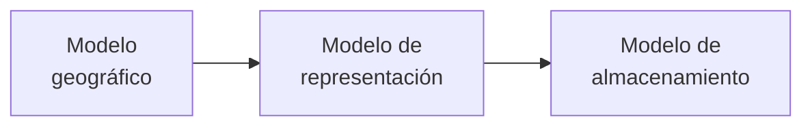
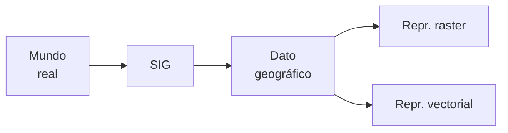

Un [[Sistema de Información Geográfica]] abstrae la realidad geográfica, mientras que la realidad relativa a una variable particular se ve abstraída en una [[Capa de Información Geográfica]] mediante un **modelo**.

El problema principal es representar la realidad, que tiene un detalle infinito, con una capacidad de almacenamiento finito. Hay 3 niveles de modelos:

1. **Modelo geográfico o conceptual**: es de alto nivel, considera la realidad geográfica y su comportamiento.
2. **Modelo de representación**: reduce el modelo conceptual a una serie finita de elementos.
3. **Modelo de almacenamiento**: es un esquema de cómo almacenar los elementos del modelo de representación. Es inherente a la naturaleza informática del SIG. Es de bajo nivel.

## Modelo Geográfico

El modelo geográfico (o de alto nivel) es un esquema mental relativo a cómo entender o interpretar la realidad geográfica. Conceptualiza la variación de la variable tratada a lo largo del espacio estudiado.

### Campos

Los *campos* son ideales para modelar variables de variación continua en el espacio:

- **Campo escalar**: a cada punto del espacio vectorial origen se le asocia un único escalar. Sirve para variables que necesitan un solo valor. $\varphi:\Bbb R^n \rightarrow \Bbb R$.
- **Campo vectorial**: el espacio vectorial destino es multidimensional. A estos datos también se los puede recoger como un conjunto de varios campos escalares.

### Entidades Discretas

El modelo de *entidades discretas* concibe un entorno geográfico como un espacio vacío rellenado por entidades. Sirve para variables discretas.

NO se asocia a cada punto geográfico un valor, y cada punto puede pertenecer a ninguna, una, o varias entidades.

Para un espacio dado, las entidades son elementos geométricos existentes en el mismo: puntos, líneas, polígonos, volúmenes.

## Modelos de Representación

Los **modelos de representación** reducen las propiedades de los modelos geográficos a un *conjunto finito de elementos* que siga siendo representativo de la realidad.

Por ejemplo, la elevación se puede representar con curvas de nivel, una malla de celdas, y puntos a intervalos regulares. Una red viaria se puede representar con una malla de celdas o un conjunto de líneas.

Hay dos modelos de representación principales al definir las capas de información geográfica:

- [[Representación Raster]]: hace una división sistemática del espacio que lo cubre completamente. Se puede analizar como matriz por su regularidad.
- [[Representación Vectorial]]: define el espacio con una serie de elementos geométricos únicamente ubicados donde ocurre el fenómeno bajo estudio.

![[Modelos de Representación.png]]

|                           | Representación Vectorial       | Representación Raster            |
| ------------------------- | ------------------------------ | -------------------------------- |
| Naturaleza                | Énfasis en dónde               | Énfasis en qué y cómo            |
| Volumen de almacenamientp | Suele ser menor                | Suele ser superior               |
| Precisión                 | Elevada                        | Limitada al tamaño del píxel     |
| Facilidades               | Fácil de mantener              | Fácil de capturar y analizar     |
| Estructura de datos       | Compleja                       | Simple                           |
| Algoritmos                | Complejos                      | Costosos en tiempo               |
| Salidas gráficas          | Mejores (escalables)           | Peores                           |
| Usos comunes              | Gestión, planificaación urbana | Estudios ambientales, climáticos |
| Límites de objetos        | Bien definidos                 | Difusos                          |

## Modelos de Almacenamiento

Los **modelos de almacenamiento** (o de bajo nivel) se usan para almacenar los elementos del modelo de representación, por lo que son específicos a si la capa es raster o vectorial.

Resuelven dos necesidades:

1. Minimizar el espacio ocupado.
2. Maximizar la eficiencia del cálculo.

En base a los modelos de almacenamiento, aparecen **formatos** para archivos y para [[Bases de Datos Espaciales]]:

- **Formatos para vectores**:
	- Archivos: ESRI Shapefile (.shp), GeoJSON, GML, KML, etc.
	- Bases de datos: PostgreSQL (con PostGIS), MongoDB, etc.
- **Formatos para raster**:
	- Archivos: Tiff/GeoTiff, ASCII Grids, MrSID, etc.
	- Bases de datos: PostgreSQL (con PostGIS), Rasterlite (Sqlite), etc.
 