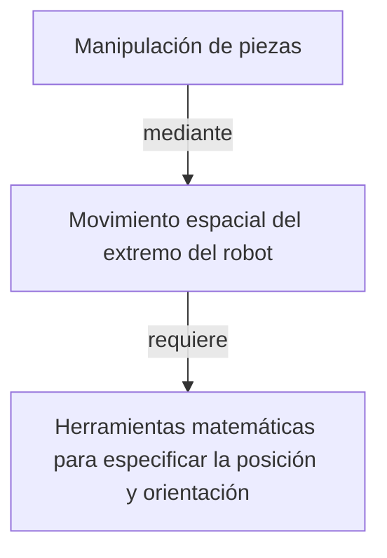

Estas **herramientas matemáticas** para la [[Localización Espacial]] son útiles en la [[Robótica]].

Representación de la posición en coordenadas cartesianas, cilíndricas, o esféricas:

![[Representación de la Posición.png]]

Representación de la orientación: sea la siguiente rotación $\left[p_x \atop p_y \right] = R \left[p_u \atop p_v \right]$ realizada con la *matriz de rotación* $R=\left[\begin{matrix}\cos\alpha & -\sin\alpha \\  \sin\alpha & \cos\alpha \end{matrix}\right]$. $R$ siempre es **ortogonal**, tal que $R^{-1}=R^T$. En 3D, la matriz podría ser: 

$$R = \left[\begin{matrix}1&0&0\\ 0 &\cos\alpha & -\sin \alpha \\ 0 & \sin\alpha & \cos\alpha\end{matrix}\right]$$

Técnicas matemáticas:

- Se puede hacer una *composición de rotaciones*, rotando en cada vez sobre distintos ejes.
- Se pueden usar *ángulos de Euler*.
- Se puede definir un vector $k$ como eje de rotación y un ángulo de giro $\theta$.
- Los *cuaternios* $Q = [q_0,q_1,q_2,q_3]=[s,\vec v]$ tienen alta eficiencia computacional.
- Se pueden usar *coordenadas homogéneas* de un espacio $(n+1)$-dimensional para representar sólidos en el espacio $n$-dimensional.

## Matrices de Transformación Homogénea

Una *matriz de transformación homogénea* es una matrix 4x4 que representa la transformación de un vector en coordenadas homogéneas de un sistema de coordenadas a otro.

$$T =\left[\begin{matrix}R_{3\times 3} & P_{3\times 1} \\ f_{1\times 3} & w_{1\times 1} \end{matrix}\right] = \left[\begin{matrix}\text{Rotación} & \text{Traslación} \\ \text{Perspectiva} & \text{Escalado}\end{matrix}\right]$$

Por ejemplo, la siguiente matriz básica de traslación:

$$T(p) = \left[\begin{matrix}1 & 0 & 0 & p_x \\ 0 & 1 & 0 & p_y \\ 0 & 0 & 1 & p_z \\ 0 & 0 & 0 & 1\end{matrix}\right] \text{ tal que } \left[\begin{matrix}r_x \\ r_y \\ r_z \\ 1\end{matrix}\right] = T \left[\begin{matrix}r_u \\ r_v \\ r_w \\ 1\end{matrix}\right] = \left[\begin{matrix}r_u+p_x \\ r_v+p_y \\ r_w+p_z \\ 1 \end{matrix}\right]$$

Es posible **combinar rotaciones y traslaciones básicas** multiplicando las matrices correspondientes. Cuidado, el producto NO es conmutativo: rotar y luego trasladar no es lo mismo que trasladar y luego rotar.

Una transformación compleja puede descomponerse en la aplicación consecutiva de transformaciones (giros y traslaciones) simples.
