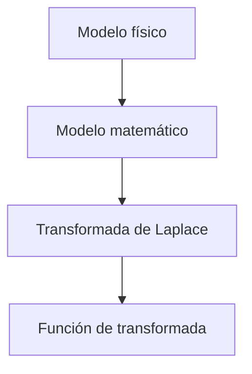

La [[Transformada de Laplace]] es una excelente herramienta para resolver los [[Modelos Matemáticos de Sistemas de Control]], que resultan muy complejos y extensos en el dominio del tiempo.

Sea la [[Función de Transferencia]]:

$$G(s)=\frac{\mathcal{L}(entrada)}{\mathcal{L}(salida)} = \frac{Y(s)}{X(s)}$$

Al aplicar la transformada de Laplace:

$$\text{Ecuación diferencial de grado } N \underbrace{\longrightarrow}_\text{Laplace} \text{Polinomio en } S \text{ de grado } N$$

$$F(s)=\frac{Y(s)}{X(s)} \begin{rcases}\longrightarrow\text{ceros cuando } Y(s)=0 \\ \longrightarrow\text{polos cuando } X(s)=0 \end{rcases} \text{ considerando variables complejas tal que $s = \sigma + jw$}$$

Se sabe que de los **polos** depende la [[Estabilidad]] del sistema.

![[Transformada de Laplace Aplicada a los Sistemas de Control.png]]

- $w$: frecuencia [[Números Complejos|compleja]], debido a que se multiplica por $j$.
- $\sigma$: amortiguamiento.

La antitransformada de Laplace se puede calcular:

- A través de tablas.
- Con la fórmula de Heaviside.
- Con herramientas de software, como MatLab.
