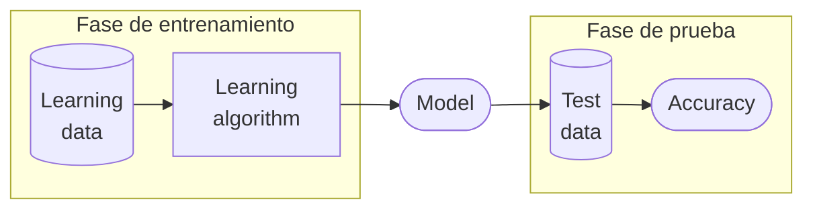

El **aprendizaje** es un proceso que ayuda a un sistema informático a mejorar su rendimiento en una tarea.

Los modelos más básicos de [[Inteligencia Artificial]] no pueden aprender por sí mismos.

El **aprendizaje automático** es una disciplina dentro de la IA que desarrolla algoritmos informáticos que evolucionan mediante experiencia y datos.

Se llama _dataset_ al conjunto de datos utilizados en un problema de clasificación:

- $A = \set{A_1,A_2,\dots,A_{|A|}}$ es un conjunto de registros (o **ejemplos**) descritos por un conjunto de **atributos**.
- $C=\set{c_1,c_2,\dots,c_{|C|}}$ es un conjunto de **clases**. Cada registro pertenece a una clase.

Se busca usar un modelo para representar el [[5to Nivel/Inteligencia Artificial/Conocimiento|Conocimiento]] del dataset. Se quiere, a partir de datos históricos, clasificar nuevos datos. Esto es el **aprendizaje supervisado**. El dataset se divide en:

- **Conjunto de entrenamiento**: para definir el modelo.
- **Conjunto de test**: para evaluar la precisión del modelo.

Inicialmente el modelo no existe, sino que se va construyendo durante el proceso de aprendizaje. Existen muchas métricas para evaluar la precisión del modelo, por ejemplo:

$$\text{Accuracy} = \frac{\text{Correct predictions}}{\text{All predictions}}$$

Se dice que el entrenamiento de este modelo es offline porque el modelo no aprende durante su funcionamiento normal.

Ejemplos de modelos con aprendizaje:

- [[Árboles de Decisión]].
